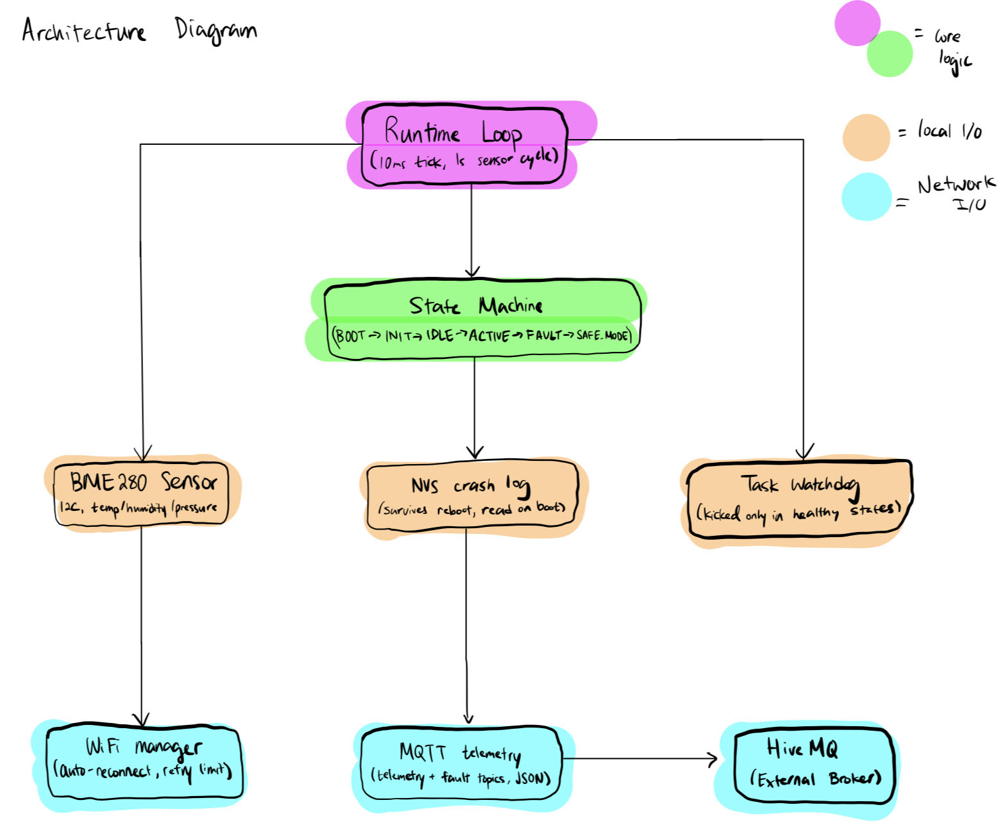
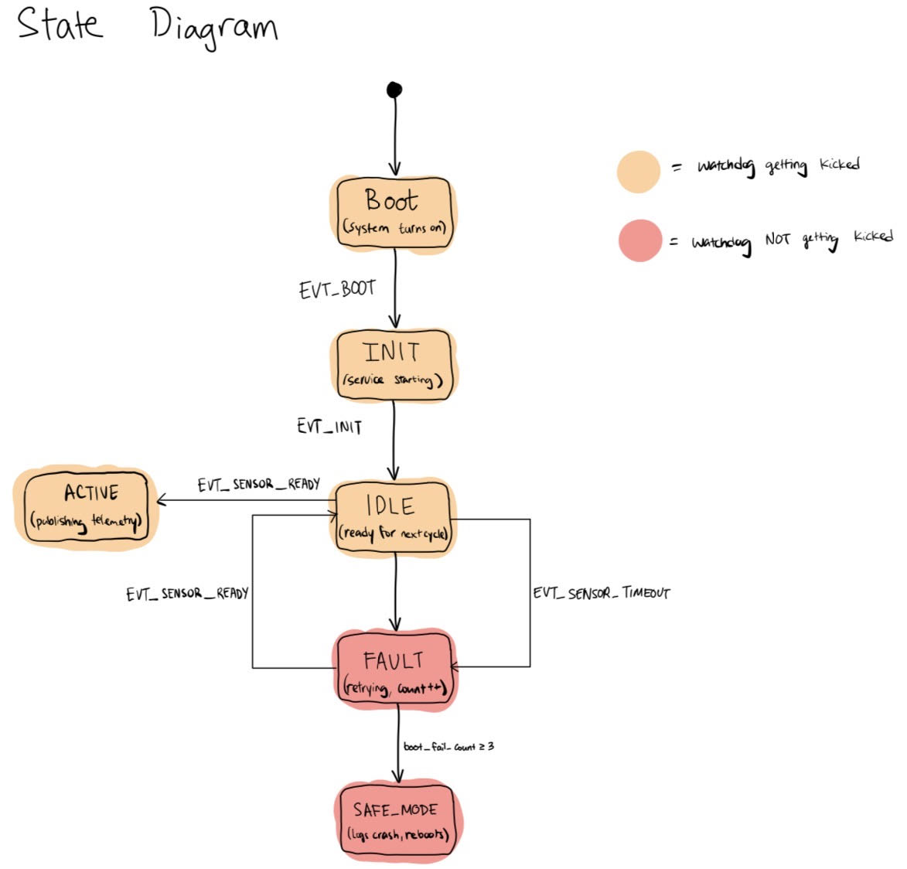
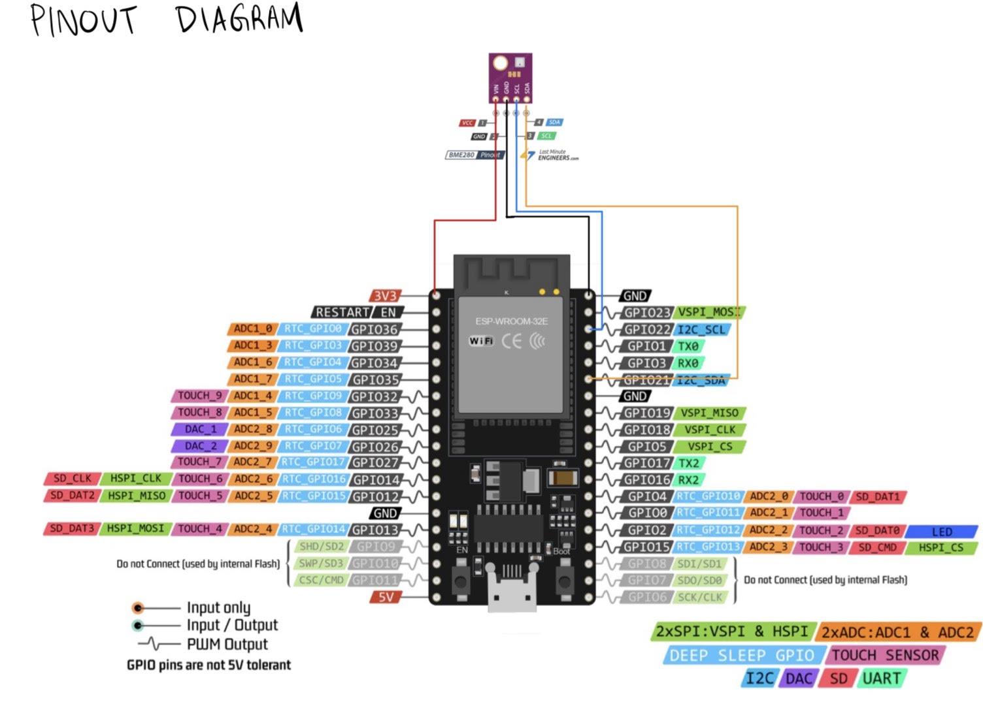

# headless_sensor_node

A fault-tolerant ESP32 firmware node built on ESP-IDF, designed to run unattended and recover from sensor failures, and report telemetry over MQTT.

## WATCH THE DEMO BELOW! (click to redirect to Youtube)

## Features
- Temperature, humidity, and pressure sensor(BM280) integration over I2C
- Fault escalation: 3 consecutive sensor failures trigger SAFE_MODE and a controlled reboot
- Crash records persisted to NVS flash - survive power loss, printed on next boot
- MQTT telemetry published every second ('headless_node_tjcdy/telemetry', 'headless_node_tjcdy/fault')
- WiFi auto-reconnect with bounded retry and graceful disconnect

## Architecture

## State machine

The watchdog is intentionally NOT kicked while in FAULT or SAFE_MODE. If the system can't recover within the watchdog window, the hardware forces a reboot.

## Hardware
- ESP32-WROOM-32E
- BME280 (I2C, default address 0x76)
- Wiring: SDA->GPIO21, SCL->GPIO22, VCC->3.3V, GND->GND

## Build & flash
\`\`\`
idf.py set-target esp32
idf.py build
idf.py -p <PORT> flash monitor
\`\`\`

## What I learned
I tested my fault-handling logic by removing my BM280 sensor mid-run, but the Task Watchdog Timer fired before my fault logic could finish executing. I found that the blocking I2C call inside the main loop was starving the watchdog timer before the fault-handling logic ever got a chance to run. I resolved this by increasing the watchdog timeout from 5 seconds to 30 seconds, and by tightening the state system during a fault from:  

FAULT -> IDLE -> FAULT -> IDLE -> FAULT -> IDLE -> SAFE_MODE   

to: 

FAULT -> FAULT -> FAULT -> SAFE_MODE 

This taught me to think about timing budgets when designing for a watchdog-supervised system.
